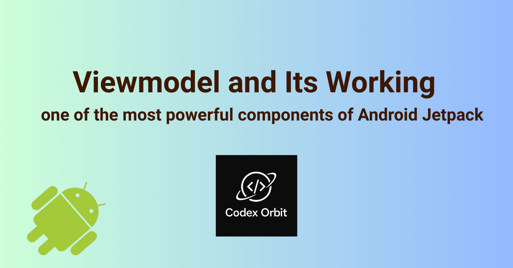

## About me

Hi, I’m **Sudesh Kumar**, a results-driven Android Developer with over **8 years** of experience
building high-performance mobile apps.

I specialize in **Kotlin**, **Jetpack Compose**, and **modern Android architecture patterns** like
MVVM and Clean Architecture. Over the years, I’ve worked on everything from startups to
enterprise-grade apps—focusing on scalability, performance, and great user experiences.

This blog is my way of sharing what I’ve learned (and continue to learn) with the Android community.
Whether it’s code patterns, real project insights, or lessons from building in production—I’m here
to make Android development a little easier and a lot more fun.

I’ve also started my own venture called **Codex Orbit**, where I continue crafting clean, scalable
Android solutions. You can learn more or get in touch
at [www.codexorbit.com](https://www.codexorbit.com).

Thanks for reading—and welcome to the journey!

## About View-Model

When we rotate a phone, switch to dark mode, or change language, Android often **destroys and recreates Activities or Fragments**. If you keep data only inside an Activity, you’ll lose it. This is where **ViewModel** comes in.  

The **ViewModel class** is part of Android Jetpack Architecture Components. It helps you store and manage UI-related data in a lifecycle-conscious way.

---

## What is ViewModel?

- A **lifecycle-aware container** for UI data.
- Survives **configuration changes** like rotation, dark mode, language, etc.
- Keeps UI logic **separate from UI controllers** (Activity/Fragment).
- Designed to **reduce boilerplate** and make apps more robust.

---

## Configuration Changes that ViewModel Survives

Whenever these changes happen, Android destroys and recreates Activities/Fragments. A ViewModel ensures your data survives:

- Device rotation (portrait ↔ landscape)
- Dark mode toggle (day ↔ night theme)
- Language or locale change (English → Hindi, LTR ↔ RTL)
- Font size changes (Accessibility settings)
- Screen density/DPI changes
- Split-screen or foldable posture change
- External display connection
- Keyboard availability (hardware keyboard plug/unplug)

---

## Exposing Data: Observable Patterns

ViewModel must expose its state so that the UI can **react** to changes. Popular patterns:

- **LiveData** → simple, lifecycle-aware (older apps)
- **StateFlow** → Kotlin-first, hot-state, great for Compose
- **SharedFlow** → for one-off events (snackbars, navigation)
- **Flow** → cold streams for data pipelines
- **mutableStateOf** → best for Compose-only local state
- **RxJava (Observable/Flowable)** → for Rx-based projects
- **callbackFlow/Channel** → wrap system callbacks (Bluetooth, Location)

### Example with StateFlow

```kotlin
data class UiState(val loading: Boolean = false, val message: String? = null)


class MyViewModel : ViewModel() {
    private val _state = MutableStateFlow(UiState())
    val state: StateFlow<UiState> = _state

    fun loadData() {
        viewModelScope.launch {
            _state.value = UiState(loading = true)
            delay(1000)
            _state.value = UiState(loading = false, message = "Data loaded!")
        }
    }
}

@Composable
fun MyScreen(viewModel: MyViewModel = viewModel()) {
    val state by viewModel.state.collectAsState()
    if (state.loading) CircularProgressIndicator()
    state.message?.let { Text(it) }
```

## How ViewModelProvider Works
- ViewModelStoreOwner → Activity/Fragment that owns the ViewModel
- ViewModelStore → Holds instances across configuration changes
- ViewModelProvider.Factory → Creates ViewModels when needed
- SavedStateHandle → Persists small state across process death

### Flow:
1. Ask ViewModelProvider for a ViewModel
2. If it exists in ViewModelStore, you get the same instance
3. Otherwise, Factory creates a new one
4. Cleared only when Activity/Fragment is truly destroyed (finish())

```kotlin
override fun onDestroy() {
    super.onDestroy()
    if (isChangingConfiguration) {
        // Destroyed because of rotation/dark mode
    } else {
        // Destroyed because user closed Activity
    }
}
```
## ActivityThread & ActivityManager (Advanced)

- ActivityThread → The main entry point of your app process. It creates the Application object and dispatches lifecycle methods.
- ActivityManagerService (AMS) → System service that decides which Activity to launch, manages tasks and processes.
- Relationship: AMS instructs ActivityThread via Binder to launch Activities, Services, etc.

### Flow: ActivityManagerService → ActivityThread → Application → Activity
- ActivityManagerService call ActivityThread which attachApplication() inside app process.
- ActivityThread call application which create Application and call onCreate() which runs    once per process.
- ActivityManagerService tell ActivityThread to scheduleLaunchActivity(AcivityName) which  will be added to manifest launcher
- ActivityThread tells Activity to Instantiate Activity object which will Call lifecycle methods: onCreate() → onStart() → onResume()
 Note: Activity is now visible and interactive


## Shared ViewModel vs Singleton
### Shared ViewModel
- Scoped to Activity or NavGraph
- Safe, lifecycle-aware
- Great for sharing state between fragments

```kotlin
class SharedVm : ViewModel() {
    val selectedItem = MutableLiveData<String>()
}
class FragmentA : Fragment() {
    private val vm: SharedVm by activityViewModels()
}
class FragmentB : Fragment() {
    private val vm: SharedVm by activityViewModels()
}
```

### Singleton
- Global lifetime
- Risk of stale data and memory leaks
- Better for stateless services (network clients, database)

| Aspect                            | ViewModel (In-memory)                                        | SavedStateHandle (Bundle)                                            | Room / DataStore / SharedPrefs (Disk)                                 | Files           (Disk)                                      |
|------------------------------------|-------------------------------------------------------------|----------------------------------------------------------------------|-----------------------------------------------------------------------|-------------------------------------------------------------|
| **Location**                       | In-memory heap <br>(RAM)                                    | Disk-backed Bundle <br>via SavedStateRegistry                        | Stored on disk <br>(SQLite DB, Proto, or Prefs XML)                   | Disk <br>(internal or external storage)                     |
| **Survive Config Changes**           | Yes — tied to Activity/Fragment lifecycle <br>survives recreation           | Yes — restored <br>from SavedStateRegistry                           | Yes — independent of <br>Activity lifecycle                           | Yes — independent of <br>Activity lifecycle                 |
| **Survive Process Death**           | No — cleared <br>when process is killed                     | Yes — small key-value <br>state restored after restart                | Yes — data on disk <br>persists across process restarts                | Yes — files remain <br>until explicitly deleted             |
| **Survive finish()**               | No — destroyed <br>when Activity/Fragment finished           | No — not restored <br>if user finishes Activity                      | Yes — persists beyond <br>Activity/Fragment lifetime                  | Yes — remains until <br>explicitly deleted                  |
| **Data Limit**                     | Medium — limited by RAM <br>(risk of OOM if large)           | Small (<100KB) — Bundle <br>size limit (Binder transaction)           | Large — MBs/GBs possible <br>depending on storage type                 | Large — limited only <br>by device storage                  |
| **Speed**                          | Fast — direct <br>in-memory access                           | Fast — small key-value <br>serialization/deserialization             | Medium — disk I/O, <br>optimized with caching                         | Medium–Slow — file I/O <br>slower than DB/DataStore |


## Key Takeaways
- ViewModel is for in-memory UI state that survives rotation and config changes.
- SavedStateHandle is for small values that must survive process death.
- Persistent storage (Room, DataStore, SharedPrefs) is for long-term data.
- Use Shared ViewModels for communication across Fragments in the same scope.
- Avoid Singletons for UI state; use them for stateless dependencies.
- Lifecycle of ActivityThread ≈ Application (both bound to process lifetime).


Happy Coding, Thanks!

**Sudesh Kumar**

[www.codexorbit.com](https://www.codexorbit.com)